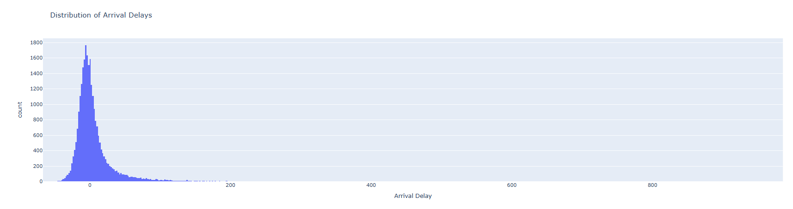
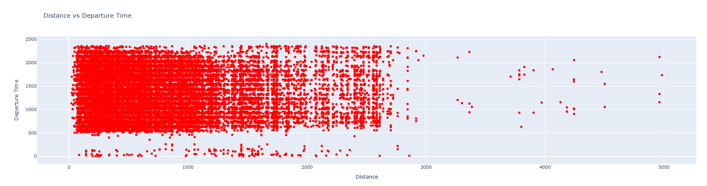
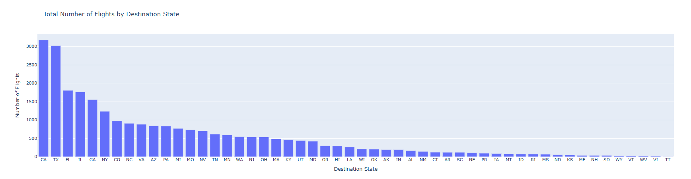
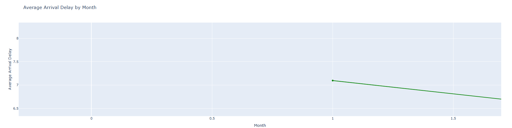
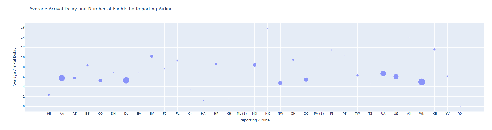
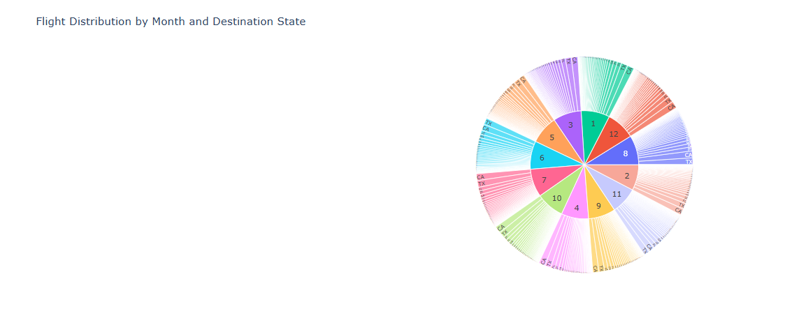

# airline-data-visualizations-plotly
Interactive data visualization project using Plotly to analyze airline performance, delays, and flight distribution through multiple chart types.
# Airline Data Visualization: From Raw Data to Insight

## Overview

Flight data can be overwhelming — thousands of records, multiple variables, and no immediate clarity.

In this project, I explored airline performance data using Plotly to transform raw flight records into meaningful, visual insights. The goal was not just to create charts, but to understand:

- Where delays occur
- How flights are distributed
- What patterns emerge across time, distance, and airlines

This project demonstrates how different visualization techniques reveal different layers of understanding.

---

## The Approach

Instead of jumping straight into conclusions, I approached this as a progressive analysis:

1. Understand distributions  
2. Explore relationships  
3. Compare categories  
4. Analyze trends  
5. Reveal hierarchy  

Each visualization builds on the previous one.

---

## 1. Understanding Delay Behavior

### Distribution of Arrival Delays

**Insight:**
- Most flights cluster around small delays or early arrivals (near 0)
- A long right tail shows **extreme delays**
- This indicates **outliers significantly impact overall performance**

Takeaway: Airline delays are not evenly distributed — a small number of flights drive major disruptions.

---

## 2. Exploring Relationships

### Distance vs Departure Time

**Insight:**
- No strong linear relationship between distance and departure time
- Flights of all distances occur across the full day
- Some outliers appear at extreme distances

Takeaway: Scheduling is not driven purely by distance — other operational factors are at play.

---

## 3. Comparing Flight Volume by Region

### Total Flights by Destination State

**Insight:**
- A small number of states dominate flight volume (e.g., CA, TX)
- Long tail of lower-frequency destinations

Takeaway: Flight traffic is highly concentrated geographically.

---

## 4. Tracking Trends Over Time

### Average Arrival Delay by Month

**Insight:**
- Slight variation across months
- Potential seasonal patterns (requires deeper dataset to confirm)

Takeaway: Delay patterns may fluctuate over time, but require further validation.

---

## 5. Multi-Dimensional Analysis

### Airline Performance (Flights vs Delay)

**Insight:**
- Larger airlines (bigger bubbles) do not always have higher delays
- Some smaller airlines show higher average delays

Takeaway: Scale does not directly correlate with performance — operational efficiency varies.

---

## 6. Hierarchical View of Flight Distribution

### Flights by Month and Destination State

**Insight:**
- Flights are distributed across months and states in a layered structure
- Certain months contribute more heavily to specific destinations

Takeaway: Hierarchical views help uncover relationships that flat charts cannot.

---

## Key Learnings

- Raw data alone does not reveal insights — visualization is essential  
- Different chart types answer different questions  
- Aggregation is critical for hierarchical visualizations (e.g., sunburst charts)  
- Outliers play a major role in real-world datasets  
- Visualization is not just about charts — it’s about clarity and decision-making  

---

## Tools & Technologies

- Python  
- Pandas  
- Plotly (Graph Objects & Plotly Express)  
- Google Colab  

---

## Final Thought

Effective data visualization is not about showing more data —  
it’s about **making the right data understandable**.

This project reflects a shift from simply plotting charts to **designing insights**.
